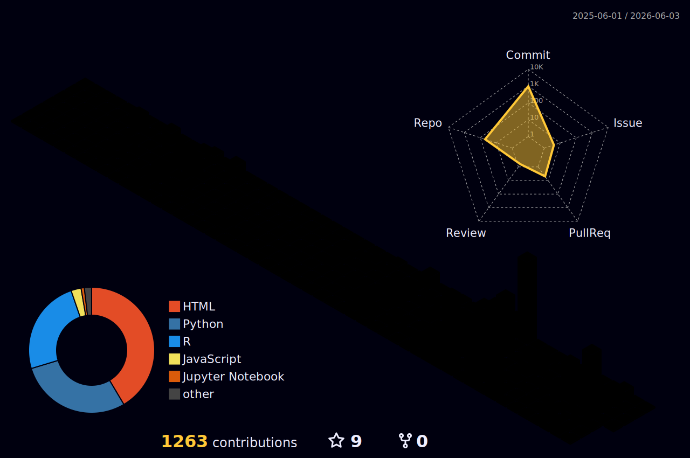

  

  

  
  
  
  

---

## 🧬 About Me

I'm a **bioinformatics researcher** passionate about uncovering the hidden world of microbial communities — particularly how the **human gut microbiome** and **environmental resistomes** influence health and disease.

My work sits at the intersection of **metagenomics**, **multi-omics integration**, and **machine learning**, where I build reproducible pipelines to answer biological questions from sequencing data.

---

## 🚀 Featured Projects

### 🦠 [PubMed Biomedical Abstract Mining & NLP Classification](https://github.com/SubhadipJana1409)
> Fetched 119 PubMed abstracts (AMR, IBD, Gut Microbiome) via Biopython Entrez API · TF-IDF + 4 ML classifiers · **Random Forest: 96% CV accuracy, AUC-ROC: 1.00**

### 🧫 [IBD Multi-Omics Analysis: Transcriptomics & Gut Microbiome](https://github.com/SubhadipJana1409)
> Integrated host transcriptomics + microbiome data · 558 DEGs identified · 14 dysbiotic bacteria · **ML model: 92.1% accuracy, AUC-ROC: 0.985**

### 🧪 [Metagenomics-Based ARG Profiling Pipeline](https://github.com/SubhadipJana1409)
> CLI pipeline: FastQC → Trimmomatic → Kraken2 → RGI · Modular Jupyter notebooks for reproducibility

### 🔬 [Genome Assembly & Annotation of *E. coli*](https://github.com/SubhadipJana1409)
> FastQC · Cutadapt · SPAdes assembly · Prokka annotation · 16S rRNA BLAST · Mann–Whitney U statistics

---

## 🛠️ Tech Stack

  

**Bioinformatics Tools**

`MetaPhlAn4` · `Kraken2` · `RGI` · `FastQC` · `Trimmomatic` · `SPAdes` · `Prokka` · `BLAST` · `Cutadapt` · `KBase`

**Languages & Data Science**

`Biopython` · `Scikit-learn` · `Pandas` · `Matplotlib` · `TF-IDF / NLP` · `DESeq2` · `limma` · `ggplot2`

**Wet Lab**

`Culture-Based Microbiology` · `DNA Extraction` · `PCR` · `Gel Electrophoresis` · `Disk Diffusion` · `MIC` · `Kirby-Bauer`

---

## 🏆 GitHub Trophies

  

---

## 🧊 3D Contribution Graph

  

---

## ⚡ Recent GitHub Activity

<!--START_SECTION:activity-->
1. 🎉 Merged PR [#1](https://github.com/SubhadipJana1409/Biomarker-Discovery-with-SHAP/pull/1) in [SubhadipJana1409/Biomarker-Discovery-with-SHAP](https://github.com/SubhadipJana1409/Biomarker-Discovery-with-SHAP)
<!--END_SECTION:activity-->

---

## 📂 Latest Repositories

<!--START_SECTION:repos-->
| Repository | Description | Language | Updated |
|------------|-------------|----------|---------|
| [subhadipjana1409.github.io](https://github.com/SubhadipJana1409/subhadipjana1409.github.io) | — | JavaScript | 1 day ago |
| [Reference-Genome-Alignment](https://github.com/SubhadipJana1409/Reference-Genome-Alignment) | — | Python | 4 days ago |
| [30DaysOfBioinformatics-Portfolio](https://github.com/SubhadipJana1409/30DaysOfBioinformatics-Portfolio) | — | HTML | 4 days ago |
| [Raw-Read-Quality-Control-with-FastQC-MultiQC](https://github.com/SubhadipJana1409/Raw-Read-Quality-Control-with-FastQC-MultiQC) | — | HTML | 6 days ago |
| [Bulk-RNA-seq-differential-expression](https://github.com/SubhadipJana1409/Bulk-RNA-seq-differential-expression) | — | Python | 12 days ago |
<!--END_SECTION:repos-->

---

## 📝 Latest Blog Posts

<!--START_SECTION:blog-posts-->
<!-- BLOG-POST-LIST:START -->
- 📄 [Finding Needles in a Haystack: How an “Ensemble” AI is Revolutionizing Gene Discovery for Diseases…](https://medium.com/@subhadipjana1409/finding-needles-in-a-haystack-how-an-ensemble-ai-is-revolutionizing-gene-discovery-for-diseases-97740779026f?source=rss-c594b02fa20f------2) — 5050 DD, 2026
- 📄 [The Data Scientist’s Guide to Saving Species: How a New Tool is Structuring the World’s…](https://medium.com/@subhadipjana1409/the-data-scientists-guide-to-saving-species-how-a-new-tool-is-structuring-the-world-s-75d56d2004a5?source=rss-c594b02fa20f------2) — 4646 DD, 2026
- 📄 [The Ghost in Your Genome: How AI is Finally Solving the Mystery of Your Ancestral GPS](https://medium.com/@subhadipjana1409/the-ghost-in-your-genome-how-ai-is-finally-solving-the-mystery-of-your-ancestral-gps-8d0ad55180ab?source=rss-c594b02fa20f------2) — 4747 DD, 2026
- 📄 [What’s Next After CAR-T?](https://medium.com/@subhadipjana1409/whats-next-after-car-t-874c7ffc13bf?source=rss-c594b02fa20f------2) — 1717 DD, 2025
- 📄 [CAR-T Cell Therapy: Engineering Immunity Against Cancer](https://medium.com/@subhadipjana1409/car-t-cell-therapy-engineering-immunity-against-cancer-ba5d823943a7?source=rss-c594b02fa20f------2) — 1414 DD, 2025<!-- BLOG-POST-LIST:END -->
<!--END_SECTION:blog-posts-->

---

## 🎓 Education

| Degree | Institution | Year | Score |
|--------|-------------|------|-------|
| M.Sc. Biotechnology | University of North Bengal | 2022–2024 | 6.29/10 |
| B.Sc. Biotechnology | Panskura Banamali College | 2019–2022 | 8.69/10 |

---

## 🌱 Currently

- 🔭 Exploring **AI-driven approaches** for omics data interpretation
- 📚 Deepening expertise in **multi-omics integration** and **microbiome-host interactions**
- 🤝 Contributing to **AMR awareness** initiatives with the American Society for Microbiology

---

## 📫 Get in Touch

  I'm always open to research collaborations, bioinformatics discussions, or just a chat about microbial genomics!  
  📧 <a href="mailto:subhadipjana1409@gmail.com">subhadipjana1409@gmail.com</a> &nbsp;|&nbsp;
  💼 <a href="https://linkedin.com/in/subhadip-jana1409">LinkedIn</a> &nbsp;|&nbsp;
  🐙 <a href="https://github.com/SubhadipJana1409">GitHub</a>

---

## 🐍 Contribution Snake

<picture>
  <source media="(prefers-color-scheme: dark)" srcset="https://raw.githubusercontent.com/SubhadipJana1409/SubhadipJana1409/output/github-snake-dark.svg" />
  <source media="(prefers-color-scheme: light)" srcset="https://raw.githubusercontent.com/SubhadipJana1409/SubhadipJana1409/output/github-snake.svg" />
  
</picture>

---

## 💡 Random Dev Quote

  

---

<!--
## 🎵 Spotify Now Playing
> **Setup needed:** Deploy https://github.com/kittinan/spotify-github-profile to Vercel with your Spotify account, then uncomment this section and add your widget URL.

  

-->

## ⏱️ WakaTime Stats

  

---

  

<i>"The microbiome is not just a part of us — it is us."</i>

  

